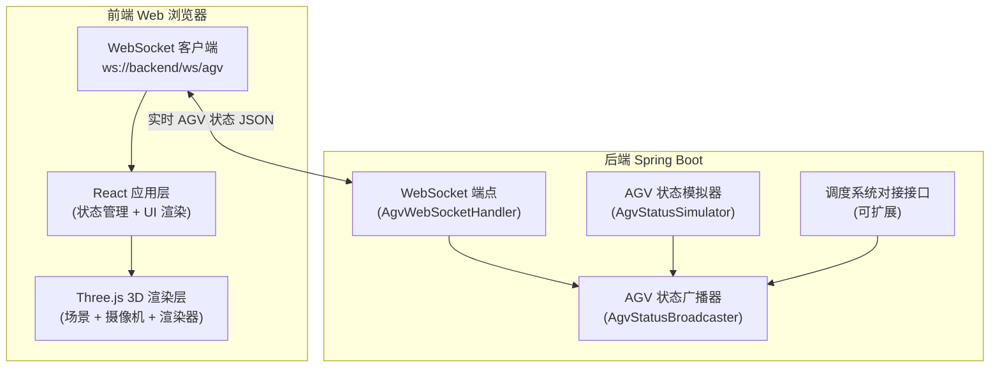
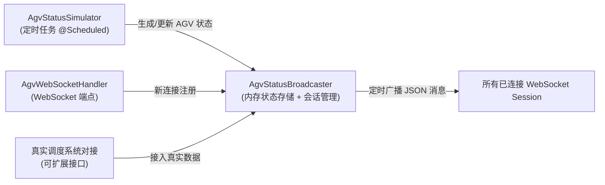

## 1. 架构设计

本项目采用前后端分离架构，前端使用 React + Three.js 进行 3D 可视化渲染，后端使用 Spring Boot 提供 WebSocket 实时数据推送。后端模拟对接真实码头调度系统，周期性生成 AGV 状态数据并广播至所有连接的前端客户端。



## 2. 技术描述

### 2.1 前端技术栈

- **框架**: React 18 + TypeScript
- **构建工具**: Vite 5
- **样式**: TailwindCSS 3
- **状态管理**: Zustand
- **3D 引擎**: Three.js 0.160 + @types/three
- **3D 辅助**: @react-three/fiber, @react-three/drei, @react-three/postprocessing
- **图标**: lucide-react
- **WebSocket**: 浏览器原生 WebSocket API

### 2.2 后端技术栈

- **框架**: Spring Boot 3.2.x
- **WebSocket**: Spring WebSocket
- **构建工具**: Maven 3.9
- **Java 版本**: JDK 21
- **序列化**: Jackson JSON

### 2.3 项目结构

```
dc9/
├── frontend/                          # 前端 React 项目
│   ├── src/
│   │   ├── components/
│   │   │   ├── Scene3D.tsx           # 3D 场景主组件
│   │   │   ├── Terminal.tsx          # 码头地面与堆场
│   │   │   ├── QuayCrane.tsx         # 岸吊模型
│   │   │   ├── AgvVehicle.tsx        # AGV 小车模型
│   │   │   ├── StatusPanel.tsx       # 状态信息面板
│   │   │   └── TopBar.tsx            # 顶部状态栏
│   │   ├── hooks/
│   │   │   └── useWebSocket.ts       # WebSocket 连接 Hook
│   │   ├── store/
│   │   │   └── useAgvStore.ts        # AGV 状态管理
│   │   ├── types/
│   │   │   └── agv.ts                # AGV 数据类型定义
│   │   ├── utils/
│   │   │   └── three-utils.ts        # Three.js 工具函数
│   │   ├── App.tsx
│   │   └── main.tsx
│   ├── package.json
│   └── vite.config.ts
├── backend/                           # 后端 Spring Boot 项目
│   ├── src/main/
│   │   ├── java/com/dc9/port/
│   │   │   ├── PortDigitalTwinApplication.java
│   │   │   ├── config/
│   │   │   │   └── WebSocketConfig.java
│   │   │   ├── handler/
│   │   │   │   └── AgvWebSocketHandler.java
│   │   │   ├── model/
│   │   │   │   └── AgvStatus.java
│   │   │   └── simulator/
│   │   │       ├── AgvStatusBroadcaster.java
│   │   │       └── AgvStatusSimulator.java
│   │   └── resources/
│   │       └── application.properties
│   └── pom.xml
└── .trae/documents/
    ├── prd.md
    └── architecture.md
```

## 3. 路由定义

| 路由 | 页面/组件 | 用途 |
|------|-----------|------|
| `/` | `App.tsx` → `Scene3D` + `StatusPanel` + `TopBar` | 数字孪生大屏主页面，全屏 3D 场景叠加信息面板 |

## 4. API 定义

### 4.1 WebSocket 接口

- **连接地址**: `ws://{host}:8080/ws/agv`
- **连接方式**: 浏览器原生 WebSocket
- **消息格式**: JSON，服务端主动推送

### 4.2 AGV 状态消息

**TypeScript 类型定义**:

```typescript
interface AgvStatus {
  id: string;           // AGV 小车唯一标识
  timestamp: number;    // 时间戳 (毫秒)
  position: {
    x: number;          // 3D 空间 X 坐标
    y: number;          // 3D 空间 Y 坐标 (高度)
    z: number;          // 3D 空间 Z 坐标
  };
  rotation: {           // 朝向角 (欧拉角，弧度)
    x: number;
    y: number;
    z: number;
  };
  speed: number;        // 行驶速度 (m/s)
  battery: number;      // 电量百分比 (0-100)
  status: 'RUNNING' | 'IDLE' | 'CHARGING' | 'ERROR'; // 运行状态
}
```

**JSON 消息示例**:

```json
{
  "id": "AGV-001",
  "timestamp": 1719024000000,
  "position": { "x": 25.5, "y": 0.3, "z": -18.2 },
  "rotation": { "x": 0, "y": 1.5708, "z": 0 },
  "speed": 2.35,
  "battery": 76.5,
  "status": "RUNNING"
}
```

**推送频率**: 约 10Hz (每 100ms 推送一次全量 AGV 状态列表)

## 5. 服务端架构



### 后端组件职责

| 组件 | 职责 |
|------|------|
| `AgvStatusSimulator` | 模拟 8-12 台 AGV 在码头路网中行驶，周期性更新位置、速度、电量 |
| `AgvStatusBroadcaster` | 保存最新 AGV 状态快照，维护所有 WebSocket 连接，定时广播状态 |
| `AgvWebSocketHandler` | 处理 WebSocket 连接建立/关闭，注册会话到广播器 |
| `WebSocketConfig` | Spring WebSocket 配置，注册端点并允许跨域 |

## 6. 数据模型

### 6.1 Java 实体类定义

```java
package com.dc9.port.model;

public class AgvStatus {
    private String id;
    private long timestamp;
    private Position position;
    private Rotation rotation;
    private double speed;
    private double battery;
    private String status; // RUNNING, IDLE, CHARGING, ERROR

    public static class Position {
        private double x, y, z;
    }

    public static class Rotation {
        private double x, y, z;
    }
}
```

### 6.2 前端 Zustand Store 设计

```typescript
interface AgvState {
  vehicles: Map<string, AgvStatus>;
  connectionStatus: 'connected' | 'disconnected' | 'connecting';
  lastUpdateTime: number;
  setVehicle: (id: string, status: AgvStatus) => void;
  removeVehicle: (id: string) => void;
  setConnectionStatus: (s: AgvState['connectionStatus']) => void;
}
```

本项目不使用数据库，数据仅在后端内存中维护模拟状态，通过 WebSocket 实时推送到前端。
