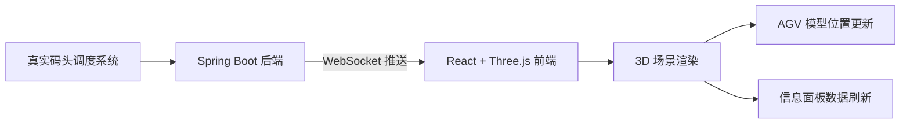

## 1. 产品概述

集装箱码头数字孪生大屏，通过 Three.js 3D 可视化技术在浏览器中实时复现自动化集装箱码头的作业场景。系统对接真实码头调度系统，将 AGV 无人引导小车的实时位置、速度、电量等数据通过 WebSocket 推送到前端，实现物理世界与数字世界的同步映射，为码头运营管理人员提供直观的全局态势感知工具。

- 核心用途：实时监控码头作业状态、AGV 车辆运行态势
- 目标用户：码头运营管理人员、调度中心值班人员
- 产品价值：提升码头可视化管理水平，辅助决策与异常预警

## 2. 核心功能

### 2.1 用户角色

| 角色 | 注册方式 | 核心权限 |
|------|----------|----------|
| 运营管理人员 | 无需登录，大屏展示 | 查看码头全局 3D 场景、AGV 实时状态、统计信息 |

### 2.2 功能模块

1. **3D 码头场景主页面**：集装箱堆场、岸吊、AGV 行驶路网的三维可视化
2. **AGV 实时监控**：多台 AGV 小车 3D 模型、位置与转向实时更新、行驶轨迹
3. **状态信息面板**：AGV 列表、速度/电量/坐标实时数据、统计概览
4. **WebSocket 实时通信**：后端推送 AGV 状态，前端实时渲染

### 2.3 页面详情

| 页面名称 | 模块名称 | 功能描述 |
|----------|----------|----------|
| 数字孪生大屏 | 3D 场景渲染 | 码头地面、集装箱堆场、岸吊设备的三维模型构建与渲染 |
| 数字孪生大屏 | AGV 车辆管理 | 根据后端推送动态创建/销毁 AGV 3D 模型，平滑更新位置与朝向 |
| 数字孪生大屏 | 信息面板 | 左侧显示 AGV 列表及状态，顶部显示全局统计（在线车辆、平均速度、总电量等） |
| 数字孪生大屏 | 摄像机控制 | 鼠标拖拽旋转场景、滚轮缩放、点击 AGV 聚焦 |

## 3. 核心流程

后端定时从调度系统获取 AGV 状态，通过 WebSocket 广播给所有前端连接；前端建立 WebSocket 连接后接收消息，解析数据并驱动 Three.js 场景中对应 AGV 模型的位置与旋转更新。

## 4. 用户界面设计

### 4.1 设计风格

- **主色调**：深空蓝 `#0a1628` 作为背景，搭配科技感青色 `#00e5ff` 作为高亮，警示红 `#ff4757` 用于低电量告警
- **辅助色**：集装箱橙 `#ff9f43`、岸吊灰 `#57606f`、AGV 标识绿 `#2ed573`
- **字体**：标题使用 Space Grotesk 或 Orbitron 科技感字体，数据显示使用等宽字体 JetBrains Mono
- **布局**：全屏 3D 场景作为背景，左上角 Logo 与标题，右上角时间与系统状态，左侧 AGV 列表抽屉，底部统计条
- **视觉元素**：HUD 风格边框、扫描线动效、数据流动发光、半透明玻璃态面板、霓虹发光边缘

### 4.2 页面设计概述

| 页面名称 | 模块名称 | UI 元素 |
|----------|----------|----------|
| 数字孪生大屏 | 3D 场景 | 深夜码头氛围、环境光 + 方向光 + 岸吊聚光灯、雾化效果、车辆灯光、地面网格发光 |
| 数字孪生大屏 | 信息面板 | 玻璃态半透明背景、边框发光、滚动列表、电量条、速度仪表盘动画 |
| 数字孪生大屏 | 顶部状态栏 | 系统标题、实时时钟、连接状态指示灯、在线车辆数 |
| 数字孪生大屏 | 交互 | 鼠标悬停 AGV 显示浮动标签、点击高亮选中、摄像机平滑过渡 |

### 4.3 响应性

- 桌面端优先设计，1920×1080 及以上分辨率最佳展示
- 自适应 2K/4K 大屏展示，保持 3D 场景全屏渲染
- 侧边信息面板可折叠以扩大 3D 可视区域

### 4.4 3D 场景指引

- **环境与氛围**：夜空环境，深蓝色背景，远景添加星空粒子，整体呈现深夜码头作业的灯火通明效果
- **光照设置**：HemisphereLight 环境光模拟夜空漫反射，DirectionalLight 模拟月光，多盏 SpotLight 模拟岸吊作业灯照亮堆场
- **摄像机设置**：PerspectiveCamera，初始俯视角 45°，俯瞰整个码头区域，支持 OrbitControls 环绕观察
- **构图与焦点**：码头呈 L 形布局，岸吊靠一侧排列，堆场居中，AGV 在路网中穿梭形成动态视觉焦点
- **交互与动画**：AGV 位置采用 Lerp 线性插值平滑过渡，车头朝向通过 lookAt 自动计算，岸吊做周期性轻微作业动画
- **后处理效果**：Bloom 泛光效果突出灯光和发光物体，轻微 Vignette 暗角聚焦视线
- **性能预算**：AGV 模型使用精简几何体（Box 组合），总面数控制在 5 万以内，目标帧率 60fps
